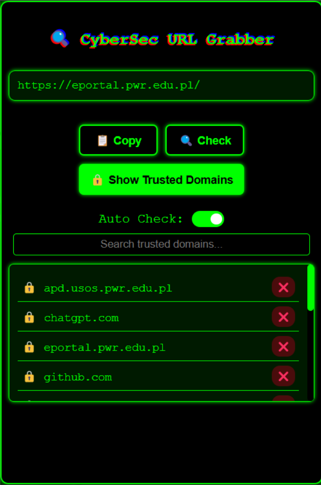
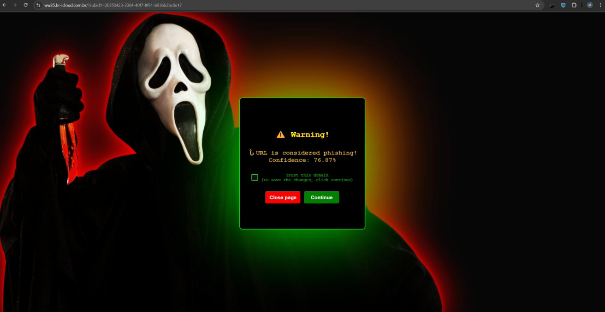
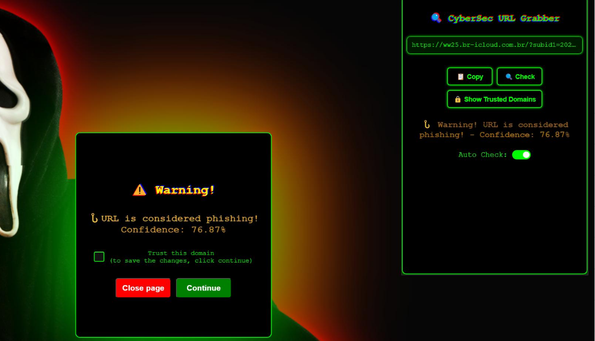

# 🔐 CyberSec URL Grabber – Browser Extension

The **CyberSec URL Grabber** is a browser extension that protects users from **malicious, phishing, and fraudulent websites** in real time.  
It integrates with the **Malicious URL Detection** models and the **API Handler**, providing a simple yet powerful interface for safe browsing.  

---

## ✨ Features
- 🌍 **Real-Time URL Analysis**  
  - Every visited or copied URL is checked against ML/DL models.  
  - Uses advanced detection: Random Forest, XGBoost, LightGBM, TabNet, DNN, GNN, Autoencoders, RBFN+RFC, and BERT.  

- 🔎 **Manual & Auto Checking**  
  - Copy & paste any URL for manual check.  
  - Enable **Auto Check** for background detection.  

- 🔒 **Trusted Domains List**  
  - Manage your whitelist of domains.  
  - Prevent false positives on frequently visited safe sites.  

- ⚠️ **Security Warnings**  
  - Suspicious pages trigger a **warning screen** with confidence level.  
  - Option to **Close Page** or **Continue anyway**.  

- 🖥️ **User-Friendly Interface**  
  - Dark theme with neon-style UI.  
  - Simple toggle and clear action buttons.  

---

## 📂 Project Structure
```
malicious_url_detection_plugin-master/
│── manifest.json          # Extension manifest
│── background.js          # Background service worker
│── popup.html             # Popup window UI
│── popup.js               # Popup logic
│── styles.css             # Styling (dark neon theme)
│── icons/                 # Icons and assets
│── README.md              # Documentation
```

---

## ⚙️ Requirements
- Browser: **Chrome / Edge / Brave** (supports Manifest v3)  
- Malicious URL Detection **API Handler** must be running  

---

## 🚀 Installation
1. Clone or download this repository.  
2. Open **Chrome** → `chrome://extensions/`.  
3. Enable **Developer mode**.  
4. Click **Load unpacked** and select the plugin folder.  
5. The **CyberSec URL Grabber** icon will appear in your browser toolbar.  

---

## 📡 How it Works
1. User opens a website.  
2. Extension extracts the current URL.  
3. URL is sent to the **API Handler**.  
4. API forwards it to the **ML/DL detection models**.  
5. A prediction is returned (Benign / Phishing / Malware).  
6. Extension displays a **real-time warning** if malicious.  

---

## 🖼️ Screenshots
|  |  |
|----------------------|-----------------------|
| **Main popup** – check URLs, manage trusted domains | **Phishing alert** – shows confidence level |

|  |
|-------------------------|
| **Popup + phishing alert combined view** |


---

## 🔬 Example Workflow
1. Copy a suspicious link → Paste into plugin → **Click "Check"**.  
2. The extension queries API → Models analyze features.  
3. If the URL is phishing, a **Warning screen** appears:  
   - "Close page" → immediately exits.  
   - "Continue" → proceeds but logs the risk.  
4. If the URL is safe, user continues browsing normally.  

---

## 🛠️ Development
- Language: **JavaScript (Manifest v3)**  
- UI: **HTML + CSS (Neon Dark Theme)**  
- Backend: **Python API + ML/DL Models**  
- Models integrated: RFC, XGB, LGBM, TabNet, DNN, GNN, Autoencoder, RBFN+RFC, BERT, Stacking  

---

## 📜 License
This project is released under the **MIT License**.  
